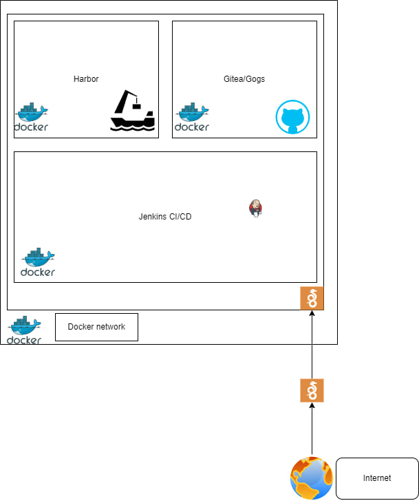

WORK IN PROGRESS

# Fast and Simple Development Env

FSDENV  (Fast and Simple Development Env) is intentded as a friendly and easy framework to start a small and self-hosted development environment

* Harbor: As a docker Registry
* Gogs: As a github style repository
* Jenkins: As CI/CD 
* Wireguard VPN (will be 2 versions. One with wireguard and one without): To access securely the network where everything resides

## Requirements:
* docker-compose
* docker engine
* terraform

## How to deploy:
* Clone the repo
* Run 
```BASH
sudo chown $(whoami): /var/run/docker.sock
```
* Run
```BASH
./starter.sh
```


# Diagram



# Repo structure:

- main.tf -> The main terraform file
- starter.sh -> Just a little script to start all this
- tunnelConstructor.sh -> When wireguard is needed this script will be executed to create tunnels.
- initHarborFuncional.sh -> A scripts that inits a harvor (was used with the dockerfile)
- docker-compose.yml -> Deprecated. Will use terraform on this branch